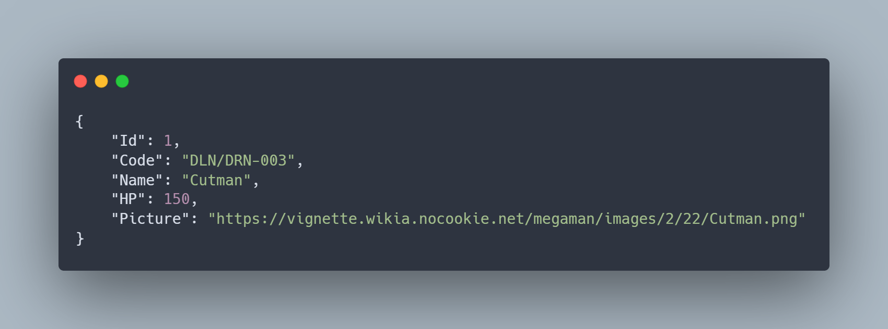

<h1 align="center">
    
    <br/>
    <b>Mega Man Robots API</b>
    <br/>
    <sub>
        <sup><b>(MEGA-MAN-ROBOTS)</b></sup>
    </sub>
    <br/>
</h1>

## Overview

The **Megaman Bosses API** is an open-source RESTful API designed to provide data about bosses from the Megaman series. The API serves JSON responses containing information such as ID, code, name, HP, and an image URL. It is built using **.NET Core 3.1** and follows modern backend development best practices.

> [!NOTE]
> This API is not affiliated with Capcom or the original Megaman series in any way.

### Features

- **RESTful API Design**: Standardized resource-oriented architecture.
- **Entity Framework Core**: ORM for database operations.
- **Dependency Injection**: Used to manage service dependencies efficiently.
- **Middleware Pattern**: Implements custom middleware for request processing.
- **JSON Serialization**: Utilizes Newtonsoft.Json for efficient JSON parsing.

## Endpoints

| Method | Endpoint | Description |
|--------|----------|-------------|
| `GET`  | `/api/v1/robots` | Returns a list of all robots. |
| `GET`  | `/api/v1/robots/{id}` | Fetches details of a specific robot by ID. Returns a `404` if not found. |
| `POST` | `/api/v1/robots` | Creates a new robot entry. |
| `PUT`  | `/api/v1/robots/{id}` | Updates details of an existing robot. |
| `DELETE` | `/api/v1/robots/{id}` | Deletes a robot entry by ID. |

### Example Response

<p align="center">
    <br/>
    
</p>

## Technologies Used

The API is developed using **.NET Core 3.1** with the following dependencies:

| Dependency | Description |
|------------|-------------|
| [Microsoft.EntityFrameworkCore](https://www.nuget.org/packages/Microsoft.EntityFrameworkCore/3.1.8) | ORM for database access |
| [Microsoft.EntityFrameworkCore.Design](https://www.nuget.org/packages/Microsoft.EntityFrameworkCore.Design/3.1.8) | Design-time support for EF Core |
| [Microsoft.EntityFrameworkCore.SqlServer](https://www.nuget.org/packages/Microsoft.EntityFrameworkCore.SqlServer/3.1.8) | SQL Server provider for EF Core |
| [Newtonsoft.Json](https://www.nuget.org/packages/Newtonsoft.Json/12.0.2) | JSON serialization library |

## Techniques Used

- **RESTful API Design**: Ensures a standard approach to API interactions.
- **Entity Framework Core**: Provides ORM capabilities for interacting with databases.
- **Dependency Injection**: Facilitates the management of service lifetimes.
- **Middleware Pattern**: Enables processing of requests and responses efficiently.
- **Unit Testing**: Implements tests to ensure API reliability.
- **Logging & Monitoring**: Uses built-in logging mechanisms for debugging.

## Monitoring & Error Handling

To ensure stability and reliability, the API implements logging and error-handling mechanisms.

### Error Codes and Messages

| Code  | Message             | Description |
|-------|----------------------|-------------|
| 200   | OK                   | Request successfully processed. |
| 400   | Bad Request           | The request was malformed or had invalid parameters. |
| 401   | Unauthorized          | Authentication is required to access the resource. |
| 403   | Forbidden             | The user does not have permission to perform this action. |
| 404   | Not Found             | The requested resource was not found. |
| 500   | Internal Server Error | An unexpected error occurred on the server. |

### Logging and Monitoring

- **Logging**: The API uses built-in logging mechanisms in .NET Core to track errors and performance issues.
- **Exception Handling**: Middleware captures and logs exceptions, returning user-friendly error messages.
- **Health Checks**: The API includes health check endpoints to monitor system status.
- **Performance Metrics**: Integration with tools like Application Insights or Prometheus for tracking API performance.

## Installation & Setup

### Prerequisites

To run the API, install the following:
- [.NET Core 3.1 SDK](https://dotnet.microsoft.com/download/dotnet/3.1)

### Installation Steps

1. Clone the repository:
   ```sh
   git clone https://github.com/your-repository/megaman-api.git
   ```
2. Navigate to the project folder:
   ```sh
   cd megaman-api
   ```
3. Restore dependencies:
   ```sh
   dotnet restore
   ```
4. Run the API:
   ```sh
   dotnet run
   ```

## Project Structure

```
.vs
.vscode
bin
Controllers
Database
middlewares
Models
obj
Properties
Services
appsettings.Development.json    
appsettings.json
global.json
MegamanApi.csproj
MegamanApi.sln
Program.cs
Startup.cs
```

### Explanation of Key Components

- **Controllers/**: Contains API controllers for handling requests.
- **Database/**: Handles database migrations and interactions.
- **middlewares/**: Contains middleware for request handling.
- **Models/**: Represents data models used in the API.
- **Services/**: Business logic for handling robot data.
- **Startup.cs**: Configures services and middleware.

